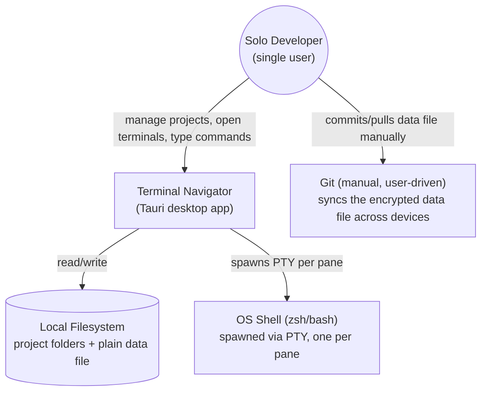
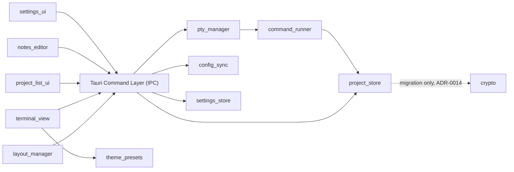

# System Architecture — Terminal Navigator

> Version 1.19 · 2026-09-24 · Status: approved
> Package: architecture.md (this file) · adr/ (decision records)
> Downstream: db-schema-designer → §5 (optional/light-touch — see note) · backend-implementer → all · design-implementer → §5.7 + §7 (frontend structure)
> Source PRD: docs/prd-terminal-navigator.md (v1.20)

## 1. System overview

Terminal Navigator is a single-user Rust + Tauri desktop application that replaces the author's Tilix + zsh workflow. It stores a list of local project entries (path, auto-run setup commands, notes) and lets the user open a terminal already `cd`-ed into a project's path with one click. Terminals live in a Tilix-style tab + split-pane grid: each project opens in a new tab, and any tab can be split into multiple independently-running terminal panes. All data (paths, commands, notes) is stored in a single plain local file — no master password, no encryption at rest (ADR-0014; see §9 for the migration path off the previous encrypted format). There is no server, no network calls, and no multi-user concern — everything runs on one machine for one person.

## 2. Non-functional requirements & constraints

NFR-1: Performance — opening a terminal + running its auto-command must feel instant (no perceptible app-side lag before the shell takes over).
NFR-2: Availability — N/A, local single-user desktop app.
NFR-3: Security / data sensitivity — paths, commands, and notes may contain credentials/API keys; stored as a plain local file, protected only by OS filesystem permissions (0600/0700); no network transmission. Encryption at rest was tried (ADR-0005) and removed (ADR-0014) as not worth the daily-use friction for a single-user local tool.
NFR-4: Scalability — personal scale only (tens to low hundreds of projects); not designed for large multi-team catalogs.
NFR-5: Portability — config must be git-trackable and/or export/importable across devices.
NFR-6: Learnability — author is new to Rust and Tauri; favor mature, well-documented, pure-Rust-where-possible libraries over cutting-edge/exotic choices.
NFR-7: Resource efficiency — app must be lightweight, fast to start, and memory-friendly, especially with several concurrent PTY sessions/panes open for long periods.
NFR-8: N/A as of ADR-0014 — there is no unlock state left to gate against. Historically required that non-sensitive preferences (theme, keybindings, sidebar position — FR-13) not require an unlock step to read or apply; kept here for changelog continuity only, no longer a live constraint.
CON-1: Solo developer, casual side-project pace, no fixed schedule.
CON-2: Author's first project in Rust and Tauri.
CON-3: No hard deadline.
CON-4: Tooling/libraries must be free / open-source — no paid dependencies or services.
CON-5: Primary target OS is Linux; Windows/macOS support is optional, not required for MVP.

## 3. System context

- **Local Filesystem** — project directories the app launches terminals into, the single plain data file holding all project data (ADR-0014), and (since FR-13) a separate `settings.json` holding non-sensitive preferences (ADR-0009) — both plain files now, distinguished only by content, not by protection level.
- **OS Shell** — one PTY-spawned shell process per open pane; the app never talks to a shell except through a PTY.
- **Git** — not integrated into the app; the user manually commits/pulls the data file as part of their own dotfiles-style workflow (NFR-5).

## 4. Architecture style

**Single Tauri desktop app, modular monolith** — Rust backend (Tauri core) split into cohesive modules, paired with a Svelte frontend (webview). No distribution of any kind: this is single-user, single-process, single-machine software, so a services split would add pure overhead with no NFR to justify it. See ADR-0001.

## 5. Module decomposition

### 5.1 project_store (Rust)
- **Responsibility:** CRUD for project entries; holds the in-memory + persisted sidebar tree of projects and folders.
- **Owns entities:** `Project` (id, name, path, setup_commands, notes, created_at/updated_at — field-level detail is backend-implementer's concern, not architecture's); `Folder` (id, name, ordered `members: Vec<Project>` — FR-11, v1.4/ADR-0011).
- **Depends on:** `crypto`, but only for the one-time migration path (ADR-0014) — no dependency on any new read/write.
- **Notes:** Sole owner of `Project` and `Folder`. No other module reads/writes project or folder data directly — `pty_manager` and `command_runner` go through this module (a `find_project(id)` lookup, not a flat list index — see below) to read a project's path/commands.
- **FR-11, v1.4 (ADR-0011):** persisted root is `Vec<SidebarEntry>` (`SidebarEntry::Project` | `SidebarEntry::Folder`), replacing the pre-FR-11 bare `Vec<Project>` — a `Folder` owns its members directly (`Vec<Project>`), so a Vec's own order *is* position (top-level and within a folder alike), flat-only nesting is enforced by the type system (a `Folder` cannot contain a `SidebarEntry`, only a `Project`), and an empty folder is removed by filtering rather than by a referential-integrity sweep. The file carries a magic-byte version marker ahead of the `bincode` payload so `load` can tell a pre-FR-11 file (bare `Vec<Project>`, no marker), the old AES-GCM envelope, and the current plain `StoreData` shape apart, transparently upgrading in memory and immediately re-persisting in the new marked format from within `load` itself — no explicit migration step, and a purely read-only session still upgrades the file on disk. `list()`'s old flat-slice accessor is gone; downstream consumers use `entries()` (for the IPC tree DTO) and `find_project(id)` (for `command_runner`/`pty_manager`'s existing by-id reads) instead.
- **Removed, ADR-0014:** the encrypted-envelope write path and the `locked`/`unlock` state machine. `load` no longer requires a password except transiently, during the one-time migration of a pre-existing encrypted file (see `crypto`, below).
- **FR-01, v1.13 (2026-08-12):** `load` takes an `Option<PathBuf>` default-home hint (resolved once at startup via Tauri's `path().home_dir()`, stored on `AppState`). Consulted only if the given path exists on disk. **Amended v1.18 (2026-09-24, debugger session):** originally applied only when `data_file` didn't exist yet; that left every install predating the seed without a "Home" entry. It now goes through `ensure_home_entry`, which `load` calls on *every* load (fresh or existing file): if no project named "Home" exists anywhere in the tree (top level or in a folder — same by-name lookup as the delete protection), one is inserted at index 0 and persisted. A failed persist of the heal is non-fatal in `load` (warning, in-memory Home for the session). `migrate_and_load` and `import_config` call it too, since neither goes through the fresh-file branch. Consequence: Home is genuinely permanent — deleting it is rejected (`ProtectedEntry`), and renaming it away is undone on the next load.

### 5.2 crypto (Rust) — scope reduced, ADR-0014
- **Responsibility:** Migration-only. Decrypt a legacy AES-GCM-encrypted data file (using a password supplied once by the user) so `project_store` can rewrite it in the current plain format. No longer used for any new write, and no longer derives keys for anything but this one-time read.
- **Owns entities:** none (a service module, not a data owner).
- **Depends on:** none.
- **Notes:** Formerly the only module that ever held a derived key in memory (ADR-0005, superseded). Slated for full removal, along with the `argon2`/`aes-gcm`/`subtle` dependencies, once the author confirms their own live data file has been migrated at least once — see ADR-0014's "explicitly deferred" note. Until then it stays, since it's the only thing that can still read the author's pre-existing file.

### 5.3 pty_manager (Rust)
- **Responsibility:** Spawn and track one PTY session per open pane; stream I/O between each PTY and its frontend pane over Tauri events, including notifying the frontend when the shell exits on its own (`pty://exit/{session_id}`, no payload — user typed `exit`, shell crashed, etc.), so the pane can close itself the same way a user-initiated "Close pane" would.
- **Owns entities:** `PtySession` (id, working_dir, process handle) — runtime-only, never persisted.
- **Depends on:** `command_runner` (to feed auto-run commands into a freshly spawned session).
- **Notes:** Closing a pane tears down exactly its own `PtySession`; sessions are fully independent of each other. A session whose shell exited on its own is *not* torn down by `pty_manager` itself — it stays registered (inert) until the frontend reacts to the exit event by calling the normal close IPC command, same cleanup path either way. See ADR-0003, ADR-0007.

### 5.4 command_runner (Rust)
- **Responsibility:** Write a project's configured setup command(s) into a freshly spawned PTY session before handing control to the user.
- **Owns entities:** none.
- **Depends on:** `project_store` (to read a project's configured commands).

### 5.5 config_sync (Rust)
- **Responsibility:** Export the current data file to a chosen location; import (replace) it from a chosen file.
- **Owns entities:** none.
- **Depends on:** none, as of ADR-0014 — import validates the plain file's shape directly (magic-byte marker check, §5.1), no decrypt step.
- **Notes:** MVP import is replace-only, not merge. See ADR-0008.

### 5.6 settings_store (Rust) — added FR-13, v1.1
- **Responsibility:** Load/save the app's non-sensitive preferences (theme preset id, keybinding map, sidebar position) to a plaintext `settings.json`, independent of whether `project_store` is unlocked.
- **Owns entities:** `Settings` (theme_preset: String, keybindings: HashMap<String, String>, sidebar_position: enum).
- **Depends on:** none — no `crypto` dependency, by design (NFR-8).
- **Notes:** Not gated by unlock; commands built on this module must remain callable before `unlock`. Validates keybinding conflicts generically (no two actions share one combo) without needing to know what any action does. See ADR-0009.

**Default keybinding registry (FR-13, extended five times post-FR-13: zoom, tab-cycling, close-session, sidebar-toggle, then pane-move).** Resolved during the FR-13 pass: the audit found only 2 real app shortcuts existed before FR-13 (both in `terminal_view`); 4 more were new actions that feature introduced (in `layout_manager`), not previously bindable by any means. The registry must stay extensible for more actions later — 2 more (`terminal.zoomIn`/`terminal.zoomOut`) were added in a follow-up pass, 2 more after that (`terminal.nextTab`/`terminal.previousTab`), and 4 more after that (`pane.moveLeft`/`moveRight`/`moveUp`/`moveDown`, v1.17), confirming that extensibility repeatedly — nothing broader ("every widget's Escape/Tab/Arrow" navigation, audited in `Modal.svelte`/`Menu.svelte`/`PaneNodeView.svelte`, is intrinsic widget behavior, not a rebindable app action):

| Action id | Default combo | Owning frontend module |
|---|---|---|
| `clipboard.copy` | Ctrl+Shift+C | `terminal_view` |
| `clipboard.paste` | Ctrl+Shift+V | `terminal_view` |
| `pane.splitBottom` | Alt+Shift+D | `layout_manager` |
| `pane.splitRight` | Alt+Shift+R | `layout_manager` |
| `pane.moveFocusLeft` | Alt+ArrowLeft | `layout_manager` |
| `pane.moveFocusRight` | Alt+ArrowRight | `layout_manager` |
| `pane.moveFocusUp` | Alt+ArrowUp | `layout_manager` |
| `pane.moveFocusDown` | Alt+ArrowDown | `layout_manager` |
| `pane.moveLeft` | Alt+Shift+ArrowLeft | `layout_manager` |
| `pane.moveRight` | Alt+Shift+ArrowRight | `layout_manager` |
| `pane.moveUp` | Alt+Shift+ArrowUp | `layout_manager` |
| `pane.moveDown` | Alt+Shift+ArrowDown | `layout_manager` |
| `terminal.zoomIn` | Ctrl+= | `terminal_view` |
| `terminal.zoomOut` | Ctrl+- | `terminal_view` |
| `terminal.closeSession` | Ctrl+Shift+W | `layout_manager` |
| `terminal.nextTab` | Ctrl+Tab | `layout_manager` |
| `terminal.previousTab` | Ctrl+Shift+Tab | `layout_manager` |
| `sidebar.toggle` | Ctrl+B | `layout_manager` (dispatch) / `project_list_ui` (`appStore.toggleSidebar`) |

`pane.splitBottom`/`pane.splitRight` reuse the existing `split_pane` Tauri command and drag-to-split semantics (FR-08) — same operation, triggered from a keybinding against the currently-focused pane instead of a drag target. `pane.moveFocus*` is purely a frontend focus change (no IPC call) via `layout_manager`'s pane-tree adjacency lookup. `pane.moveLeft`/`moveRight`/`moveUp`/`moveDown` (v1.17) are the keyboard equivalent to drag-to-move (components.md v3.1) — closes that feature's own accessibility `⚠️ TBD`. Also purely frontend, no IPC call: `terminalStore.movePaneInDirection` reuses `pane.moveFocus*`'s own `findPaneInDirection` geometric-neighbor lookup to find which pane is adjacent, then relocates the *focused* pane onto it via `movePaneWithinTab` (the same detach-and-graft the drag path uses) — a no-op at the edge of the grid or when the focused pane is its tab's only one, same rule `pane.moveFocus*` already follows. Alt+Shift+Arrow pairs with plain Alt+Arrow (`pane.moveFocus*`) the same way `pane.splitBottom`/`pane.splitRight`'s Alt+Shift+D/R already pairs with a plain-Alt sibling action in this registry. `settings_store::load` backfills any action id missing from an already-persisted `keybindings` map with its current default (`backfill_missing_keybindings`, added alongside this extension) — necessary because, unlike a whole missing settings.json *field* (`#[serde(default)]`), a `HashMap`'s missing individual keys aren't restored by serde on their own; without the backfill, every prior registry extension (zoom, tab-cycling, sidebar-toggle, and now pane-move) would stay permanently unreachable for any install whose settings.json predates it. `terminal.zoomIn`/`zoomOut` are a pure `terminal_view` concern (xterm.js font-size adjustment + refit) — no IPC call either; **not yet implemented as of this table update**, this is a registry-only extension (settings_store defaults + frontend registry), the actual zoom mechanism is a separate, still-pending design-implementer pass. A companion Ctrl+Scroll (mouse wheel) gesture for the same zoom action is also planned but is a fixed gesture, not itself a rebindable entry in this table — the same relationship `pane.splitBottom`'s keybinding has to drag-to-split's fixed gesture for the same underlying operation. `terminal.nextTab`/`previousTab` switch which *tab* is active (`terminalStore.activeTabId`) — a different concept from `pane.moveFocus*`, which moves focus between panes within one already-active tab; also not yet implemented as of this table update, `layout_manager`'s job in the next pass (a `terminalStore` cycle-tab method + `TerminalArea.svelte` keydown wiring, same capture-phase pattern as the pane shortcuts). `terminal.closeSession` closes the **focused pane**, not the whole tab — the tab closes with it only when that pane was its last one, which is `terminalStore.closePane`'s existing rule, so the shortcut reuses `TerminalArea.svelte`'s `handleClosePane` verbatim (including its `close_terminal` IPC teardown and `terminal-registry` disposal) rather than introducing a second close path. Named `closeSession` rather than `closePane` to match the user-facing vocabulary the sidebar already uses ("Close terminal"), and defaulted to Ctrl+Shift+W for parity with Tilix/Terminator, the tools this app's terminal behavior is modeled on. `sidebar.toggle` drives the existing manual full-hide control (components.md "Sidebar show/hide toggle", already exposed as a button in `Sidebar.svelte` since FR-13 v1.4) — this extension only adds the keyboard trigger, no new UI; it ships wired, not registry-only, same as `terminal.closeSession`. Deliberately checked in `TerminalArea.svelte`'s `handleGlobalKeydown` *before* the `!tabId || !tab` guard the other actions share, since hiding/showing the sidebar has no dependency on an active tab or focused pane existing. Defaulted to Ctrl+B for parity with the same binding in VS Code and most terminal multiplexers' sidebar/tree-toggle convention.

**Gap found while adding these last two (KeybindingRow.svelte, unrelated to this table) — since fixed:** the Settings panel's rebind-capture logic checked `event.key === "Tab"` to let Tab move focus normally within the modal while another row records — but `event.key` is `"Tab"` regardless of held modifiers, so `Ctrl+Tab`/`Ctrl+Shift+Tab` could never actually be *captured* through that UI; every attempt cancelled recording instead. Resolved in the design-implementer pass that implemented tab-cycling: the check now only cancels for *bare* Tab (or Shift+Tab — Shift alone isn't a "required modifier," see `hasRequiredModifier`), so a modified Tab falls through to normal capture like any other combo.

### 5.6a git_status (Rust) — added FR-17, v1.10
- **Responsibility:** Given a directory path, determine its current git branch (or a detached-`HEAD` short commit hash), for display in a pane's title.
- **Owns entities:** none (a stateless, read-only service module).
- **Depends on:** none.
- **Notes:** Reads `.git/HEAD` directly (walking up parent directories, and following a worktree/submodule's `.git` *file* indirection when present) rather than shelling out to `git` or linking `libgit2` — same pure-Rust, no-C-library preference ADR-0004/0005 made for storage/crypto, and no per-lookup process-spawn cost (NFR-7). Not a git repository (or any read failure) is `None`, not an error — mirrors `commands::path_exists`'s "smallest possible surface, boolean/optional result, no broader filesystem access exposed" shape.

### 5.7 Frontend modules (Svelte, webview)
- **project_list_ui** — renders the project list; add/edit/delete forms; the native folder-browse dialog trigger (calls Tauri's dialog API). *Extended, FR-01 v1.14:* `+page.svelte`'s startup `onMount` (after the initial `initStore()`/`finishLoading` load) now auto-opens a terminal tab on the seeded "Home" entry when no tab is open yet — no new Tauri command. *Amended, security audit L7 (2026-09-24):* that logic now lives in `src/lib/launch.ts` (`autoOpenHomeOnLaunch`) and no longer goes through `openTerminal`/`spawn_for_project` — it opens a **plain shell** via the `openPlainTerminal` wrapper (IPC `split_pane` → `pty_manager::spawn`, no `command_runner`), because the entry is matched by name and its `setup_commands` may come from an imported file; launch must never auto-run them. A deliberate sidebar open still uses `openTerminal` and runs them. The lookup itself (`appStore.homeProject`, a new getter on the frontend `AppStore` module) is a plain name match over `allProjects`, same "not protected, not specially tracked" rule the seed itself follows (FR-01) — resolves to `null` (silent no-op, not an error) once the entry is deleted or renamed. *Fixed (debugger session, 2026-08-13):* that no-op also fired — wrongly, from the user's perspective — for any install whose data file already existed before v1.13's Home-seed shipped, since seeding never retroactively applies to an existing store (§5.1 above). `+page.svelte`'s `autoOpenHomeOnLaunch` now falls back to a new `openHomeDirTerminal`, which opens a terminal at the platform home directory directly: two new thin commands, `home_dir` (returns `AppState.home_dir` as a string — the same value the v1.13 seed already resolves at startup, just exposed read-only) and `open_home_terminal` (mirrors `open_terminal`'s event-wiring but calls `pty_manager::spawn` directly instead of `spawn_for_project`, since there's no stored `Project` here — no setup commands run). Nothing is written to the sidebar or the data file; `terminalStore.openTab(null, "Home", path)` uses the tab store's existing `projectId: string | null` support (already typed for exactly this, previously unused).
- **layout_manager** — owns tab/pane grid state (which panes exist, their arrangement, active tab); pure UI state, no PTY knowledge beyond session IDs. *Extended, FR-13:* also resolves "adjacent pane in direction X" (for keyboard pane-focus movement) and exposes a "split focused pane in direction X" operation callable from a keybinding as well as from drag-to-split (FR-08) — same underlying split operation, two trigger sources. *Corrected (debugger session, 2026-07-23):* "adjacent pane in direction X" is now resolved **geometrically**, using the split `sizes` fractions the pane tree already carries, rather than by entering the neighbouring subtree at its first leaf. The old i3/tmux-style pure-tree traversal picked the correct neighbouring *subtree* but then always focused that subtree's first leaf, so in any grid deeper than one split (a 2×2, the common four-pane case) it landed on a diagonal pane instead of the adjacent one, and moving left/up entered the neighbour from its far edge. Adjacency is a screen-geometry question, and the tree alone under-determines it; `sizes` is the geometry the model already has, so no new pixel-position tracking was needed. Exact-boundary ties resolve to the first/upper pane, matching tiling-WM convention. *Extended again, FR-17:* the pane title bar (`PaneNodeView.svelte`'s `pane-header`, already showing the pane's cwd) is extracted into its own `PaneTitle.svelte` — one instance per leaf, so each can independently call `get_git_branch` (→ `git_status`, §5.6a) once on mount and append the result after the path. Deliberately not a `layout_manager` state field: the branch is display-only, per-pane derived data with no bearing on tab/pane grid state itself, so it lives in the new component rather than `terminal.svelte.ts`'s store. The lookup itself is routed through `$lib/git-branch-cache` (per-cwd memoization, same module-level-singleton-plus-test-reset-hook shape as `$lib/terminal-registry`) rather than called directly, so a forced leaf remount — the same class of pane-tree restructuring `terminal-registry` exists to survive for `TerminalPane` — reuses the already-resolved value instead of repeating the IPC round-trip. *Extended again, FR-17 focus-refresh follow-up:* `PaneTitle.svelte` now also takes a `focused` prop (`child.sessionId === focusedPaneId`, the same expression `TerminalPane`'s own `focused` prop already uses) and, on every transition to focused, calls `git-branch-cache`'s new `refreshGitBranch` — a cache-*bypassing* re-fetch, distinct from `getCachedGitBranch`'s reuse-what's-cached behavior — so a `git checkout` run inside the pane is reflected the next time the user clicks back into it. A manual refresh button next to the title calls the same `refreshGitBranch` path on click, for updating without a focus round-trip. Deliberately not a poll timer or a filesystem watcher on `.git/HEAD` (both considered — see PRD FR-17's edge cases for the cost/complexity reasoning): this reuses a signal (`focused`) `layout_manager` already computes, rather than adding a new per-pane background resource.
- **terminal_view** — one `xterm.js` instance per *session*, rendering PTY output and forwarding keystrokes; subscribes to that session's event stream. *Extended, FR-13:* applies the selected theme preset's full xterm `Theme` object (see `theme_presets`, below) instead of a partial set of CSS-var-derived colors; looks up clipboard copy/paste combos from `keybindings` state instead of the hardcoded Ctrl+Shift+C/V. *Extended again (debugger session, perpendicular-split remount bug):* the `Terminal` instance, its scrollback, and its PTY subscriptions are no longer owned by `<TerminalPane>`'s own Svelte component lifecycle — they live in a small session-keyed registry (`$lib/terminal-registry`) that survives a forced component remount, because certain `layout_manager` tree restructurings (a cross-direction split, a drag-to-split graft) force Svelte to destroy and recreate the component even though the session itself never closed, and no `{#each}` keying strategy can prevent that (the leaf's key leaves its old block's key space entirely). Disposal is centralized to the two call sites that actually confirm a session closed (`TerminalArea.svelte`'s `handleClosePane`, `Sidebar.svelte`'s `closeSession`), never `<TerminalPane>`'s own `onDestroy`. *Extended again, FR-16:* loads `@xterm/addon-web-links` alongside the existing fit addon to detect `http(s)://` URLs in a pane's buffer; the addon's activation handler is `terminal_view`'s own, gating on `event.ctrlKey && event.button === 0` before calling `openUrl()` from `@tauri-apps/plugin-opener` — xterm.js does no modifier gating itself, so an ungated handler would hijack every plain click. No new Tauri command: `opener:default` was already granted in `src-tauri/capabilities/default.json` for FR-01's file-browse dialog and its `allow-open-url` permission covers `http(s)://` directly. Like Ctrl+Scroll zoom (§5.6), this is a fixed gesture, not a `keybindings` registry entry — there is no keyboard combo to rebind, only a mouse-click modifier.
- ~~**unlock_screen** — master password entry on launch; calls `crypto` (via IPC) to unlock.~~ **Removed, ADR-0014** — no unlock step; the app opens straight to the project list. A one-time migration prompt (not a persistent screen/module) may still ask for the legacy password exactly once if the author's existing encrypted file hasn't been migrated yet — see ADR-0014.
- **notes_editor** — per-project notes view/edit, shown alongside a project's detail.
- **settings_ui** *(new, FR-13; master-password-change sub-form removed, ADR-0014)* — renders the Settings modal (theme picker, keybinding rebind list with conflict feedback, sidebar-position toggle); reads/writes through `get_settings`/`save_settings` IPC commands.
- **theme_presets** *(new, FR-13)* — static, frontend-only data module: the fixed list of named presets, each a complete xterm.js `Theme` (background, foreground, cursor, cursorAccent, full ANSI 16-color table). Owns no Rust-visible state — the backend only ever sees the selected preset's id (ADR-0009). Concrete preset values are ui-ux-designer's to define (PRD Q6).

**Dependency rule:** arrows point one way; a change that introduces a cycle is an architecture change and requires a new ADR.

> **Note on db-schema-designer applicability:** storage is a single serialized+encrypted blob (ADR-0004) plus, since FR-13, a second plain `settings.json` (ADR-0009) — neither is a relational database, so there is no ERD to draw. db-schema-designer can still be used in a light-touch way to nail down the `Project` or `Settings` struct's fields/types/validation rules if useful, but it is not required before backend-implementer starts; plain Rust struct definitions are sufficient for this project's scale (NFR-4).

## 6. Cross-cutting decisions

| Concern | Decision | Driven by | ADR |
|---|---|---|---|
| AuthN | N/A, ADR-0014 — no login/unlock step; the app opens directly | — | 0014 (supersedes 0005) |
| AuthZ | N/A — single user, no roles | — | — |
| Key derivation | N/A, ADR-0014 — `crypto`'s Argon2id path survives only to decrypt a pre-existing legacy file during the one-time migration | — | 0014 (supersedes 0005) |
| Encryption at rest | Removed, ADR-0014 — the author decided the daily password friction wasn't worth the confidentiality guarantee for a single-user local tool; data is now a plain file protected only by OS filesystem permissions | — | 0014 (supersedes 0004/0005) |
| Background jobs | None needed | — | — |
| Caching | None needed (personal-scale in-memory data) | NFR-4 | — |
| File storage | Single plain file (JSON/bincode), doubles as the git-trackable/export artifact; a legacy AES-GCM-encrypted file is transparently migrated to this format the first time it's loaded post-ADR-0014 | NFR-5, NFR-6 | 0004, 0014 |
| Envelope schema evolution | Magic-byte version marker ahead of the `bincode` payload distinguishes the pre-FR-11 legacy shape, the old AES-GCM envelope, and the current plain `StoreData` shape; any older shape is auto-upgraded on load and rewritten in the current format on next save | FR-11, NFR-3 | 0011, 0014 |
| Terminal rendering | `xterm.js` + WebGL renderer addon | NFR-7 | 0006 |
| Window transparency | Window created `transparent: true` **unconditionally** in `tauri.conf.json`; the user's intensity setting drives CSS root-background alpha only, never the window flag (which is creation-time-only in Tauri 2.11 — there is no `set_transparent()`). Requires a compositing WM; degrades to opaque without one | FR-15, NFR-10, CON-6 | 0012 |
| Window decorations | `decorations: false` unconditionally in `tauri.conf.json`, uniformly on every platform (no macOS-idiomatic branch) — native title bar/controls are replaced by an in-app custom control set. Frontend gains explicit `core:window:allow-{minimize,toggle-maximize,close,start-resize-dragging}` capabilities — trimmed to exactly what's called; dragging uses the declarative `data-tauri-drag-region` attribute (no permission needed), and `allow-maximize`/`allow-unmaximize` aren't granted since only `toggleMaximize()` is used. Dragging/resizing, previously free from the OS, are built in the frontend (drag region + resize handles) | CON-5 | 0013 |
| Notifications | N/A | — | — |
| Logging & errors | `tracing` crate → local log file, for the author's own debugging while learning Rust | NFR-6, CON-2 | — |
| Backups | Covered by FR-07 export; no separate backup system | NFR-4 | — |
| Packaging | Tauri's built-in bundler → AppImage + `.deb` | CON-4, CON-5 | — |
| Non-sensitive settings storage | Plain `settings.json` in the same `app_data_dir()`, owned by `settings_store` — no longer a distinct "unencrypted" category once `project_store`'s own file is also plain (ADR-0014) | FR-13 | 0009 |
| Master password rotation | Removed, ADR-0014 — no master password left to rotate. The atomic-write pattern (temp file + rename) this decision introduced is retained and now applies directly to `project_store`'s plain `persist()` | — | 0014 (supersedes 0010) |

## 7. Tech stack

| Layer | Choice | Rationale |
|---|---|---|
| App shell | Tauri | User's explicit choice; produces a far lighter binary than Electron (NFR-7) with no bundled Chromium |
| Backend | Rust | Fixed by user's choice; also Tauri's native language |
| Frontend framework | Svelte | Compiles away the framework at build time — no virtual DOM, smaller bundle, lower runtime memory than React — directly serves NFR-7 with FR-08's many concurrent panes. See ADR-0002 |
| Terminal renderer | `xterm.js`, default (non-WebGL) renderer | Industry standard (VS Code, Hyper). `@xterm/addon-webgl` was tried for cheaper multi-pane CPU/memory (NFR-7) but disabled 2026-07-21 after proving it never actually paints — see ADR-0006's revisit |
| PTY | `portable-pty` (WezTerm project) | Mature, cross-platform (Linux/macOS/Windows via ConPTY), proven in production. See ADR-0003 |
| Storage | Single plain file (`bincode`/`serde_json`) | Simplest for a Rust beginner (NFR-6); pure-Rust; file itself satisfies NFR-5. See ADR-0004; encryption removed by ADR-0014 |
| Crypto | `argon2` + `aes-gcm` (RustCrypto) — migration-only, ADR-0014 | Retained solely to decrypt the author's one pre-existing legacy file on first load post-migration; slated for full removal once that's confirmed done. See ADR-0005 (superseded), ADR-0014 |
| Logging | `tracing` | Standard Rust ecosystem choice, low overhead |
| Packaging | Tauri bundler (AppImage, `.deb`) | Built in, free, no extra tooling (CON-4) |

## 8. Deployment shape

One box: the author's own Linux machine, running the AppImage or `.deb` package Tauri's bundler produces. No server, no cloud infra, no CI/CD requirement for the app to function.

**At 10× load** (many more projects, or much larger notes per project): the single-encrypted-file approach still holds — NFR-4 caps realistic scale at "hundreds of projects," well within what an in-memory struct + serialize-on-write can handle instantly. If that ceiling is ever genuinely exceeded, the only module that needs to change is `project_store` (swap its persistence backend to SQLite) — no other module is coupled to the storage format, by design (§5.1).

## 9. Risks & open questions

1. **Compounding first-Rust-project risk.** PTY handling, multi-pane multiplexing (FR-08), and encryption are each individually nontrivial for a first Rust/Tauri project; doing all three at once risks stalling momentum. *Mitigation:* no architectural blocker — implement incrementally (single-tab/single-pane first, then tabs, then split-panes) since CON-1/CON-3 impose no deadline. Revisit if the author reports being stuck for multiple sessions on any one module.
2. **WebGL renderer availability.** ~~`@xterm/addon-webgl` requires a working WebGL context in the webview...~~ **Resolved 2026-07-21 (ADR-0006 revisit):** the risk materialized, but not as originally framed — WebGL context creation succeeded (no errors, not lost), yet the addon never issued a single visible draw call, confirmed via `gl.readPixels()` on the framebuffer. Not a context-availability problem the `try/catch` fallback could catch. Disabled app-wide; xterm.js's default renderer is now the only path. Revisit only once a newer `@xterm/addon-webgl` release is confirmed (by the same read-pixels method, not just absence of console errors) to actually paint.
3. **Import replace-only (ADR-0008) may feel limiting later** if the author wants to merge project lists from two devices rather than fully replace. *Revisit if:* this friction is actually felt in practice — add merge logic as a next-iteration feature at that point, not before.
4. **Windows/macOS support (CON-5, optional)** is not blocked by any decision here — `portable-pty` and Tauri both support all three OSes — but has not been tested. *Revisit when/if the author actually wants to run on those platforms.*
5. **One-time migration off the encrypted format (ADR-0014).** The migration path (decrypt the author's one existing legacy file, rewrite as plain, never touch `crypto` again after that) is new code exercised against the author's real, only copy of their project data. *Mitigation:* write-to-temp-then-atomic-rename (the same pattern ADR-0010 already established), and don't delete/overwrite the original encrypted bytes until the new plain file is confirmed written. *Revisit:* once the author confirms migration succeeded, delete the migration code, the `crypto` module, and the `argon2`/`aes-gcm`/`subtle` dependencies outright — see ADR-0014's "explicitly deferred" note. Also flag `security-auditor` for a fresh pass: this removes a control (encryption at rest) that `docs/security/audit-2026-07-20.md` previously verified sound, so the trust-boundary section of that audit is now stale and needs re-evaluation, not just a note.
6. **User-rebound keybindings colliding with OS/webview-native commands (FR-13).** The clipboard shortcut bug fixed 2026-07-20 (`TerminalPane.svelte`'s Ctrl+Shift+V silently double-firing because the browser/webview's own native paste action wasn't suppressed) is one instance of a general class: once users can rebind shortcuts to arbitrary combinations, any combo the OS/WebKitGTK treats as a native command is a similar risk, not just the one already fixed. *Mitigation:* design-implementer/backend-implementer should call `event.preventDefault()` for every custom-handled combo (not just the two already covered), and ui-ux-designer should consider warning the user in the rebind UI if a chosen combo is a common OS-reserved one. No architectural blocker — this is an implementation-discipline risk, not a structural one.

## 10. Instructions for AI agents

You are working within this architecture. Follow these rules:

1. **Source-of-truth order:** `adr/` (rationale) → this file (structure) → downstream docs for their own domains. On conflict, report it; don't silently pick.
2. **Respect module boundaries.** Code for one module never reaches into another module's entities directly (e.g., frontend `terminal_view` never reads `project_store` data except through the IPC layer; `pty_manager` never persists data itself — that's `project_store`'s job). New cross-module dependencies require updating §5 + an ADR.
3. **Entity ownership is exclusive.** Only `project_store` reads/writes `Project` and `Folder`; only `pty_manager` creates/destroys `PtySession`; only `settings_store` reads/writes `Settings` (theme/keybindings/sidebar position) — it has no `crypto` dependency and must stay that way.
4. **Cross-cutting concerns use §6's decisions** — never introduce a second storage format, crypto scheme, or terminal-rendering approach without a new ADR.
5. **Uncovered cases:** follow the nearest decision's pattern, flag as "unspecified — architecture review needed" in your summary.
6. **Do not modify this package** unless explicitly asked; propose changes as draft ADRs instead.
7. **db-schema-designer is optional here** (see §5 note) — do not force a relational schema onto a single-file store; only invoke it if the `Project` data model grows complex enough to warrant it.
8. **api-designer does not apply** — there is no REST/GraphQL API; the module contract in §5 plus Tauri command signatures (defined during backend-implementer's work) is the equivalent contract.

## 11. Changelog

| Version | Date | Change |
|---|---|---|
| 1.19 | 2026-09-24 | Security fix (audit v1.7 L7): §5.7 `project_list_ui` launch auto-open opens a plain shell (`split_pane` path, no `command_runner`) instead of `open_terminal`; logic extracted to `src/lib/launch.ts`. No module boundary, IPC-surface or ADR change — see PRD v1.20. |
| 1.18 | 2026-09-24 | Bugfix (debugger session): §5.1 `project_store::load`'s Home-seed extended from first-run-only to every load via new `ensure_home_entry` (also called from `migrate_and_load`/`import_config`) — see the amended FR-01 v1.13 bullet above and PRD v1.19. No module boundary or ADR change. |
| 1.17 | 2026-08-21 | Keybinding registry extended to 18 actions (§5.6): `pane.moveLeft`/`moveRight`/`moveUp`/`moveDown` (Alt+Shift+Arrow*), the keyboard equivalent to drag-to-move (components.md v3.1) — closes that feature's accessibility `⚠️ TBD`. `layout_manager`'s `terminalStore.movePaneInDirection` reuses `pane.moveFocus*`'s own `findPaneInDirection` lookup plus the drag path's `movePaneWithinTab`; no new tree logic, no IPC. Same-session fix, found while wiring these in: `settings_store::load` (§5.6) now backfills any action id missing from an already-persisted `keybindings` map with its current default (`backfill_missing_keybindings`) — a `HashMap`'s individual missing keys aren't restored by `#[serde(default)]` the way a whole missing struct field is, so without this fix every prior registry extension (zoom, tab-cycling, sidebar-toggle, and now pane-move) would have stayed permanently unreachable for any install whose settings.json predates it; regression tests added (`load_backfills_keybindings_for_actions_added_after_the_file_was_written`, `load_does_not_overwrite_an_explicitly_rebound_keybinding`). PRD FR-08 amended in the same change-set (v1.17). |
| 1.16 | 2026-08-13 | Bugfix (debugger session — user report: launch still showed the empty-state placeholder despite v1.15): §5.7 `project_list_ui`'s v1.14 launch auto-open assumed a "Home" project always exists, but §5.1's Home-seed is one-time-on-a-brand-new-store only, so any pre-existing install (verified against the author's own live data file) never gets one and the auto-open silently no-op'd. Added two new thin commands, `home_dir` and `open_home_terminal` (§10 rule 2: shape DTOs/delegate only, no business logic), as a fallback that opens a terminal at the platform home directory directly when no "Home" entry exists — bypassing the project store, nothing written to the sidebar or data file. PRD FR-01 amended a third time in the same change-set (v1.15). |
| 1.15 | 2026-08-13 | Small, uncontested addition (routed via project-navigator straight to backend-implementer — no architectural decision to make, single obvious implementation, frontend-only): §5.7 `project_list_ui` extended — window launch now auto-opens a terminal on the FR-01-seeded "Home" entry when no tab is open yet, via a new `appStore.homeProject` getter and a call from `+page.svelte`'s existing startup `onMount`. Reuses the existing `openOrSwitchToTab`/`openTerminal` path; no new Tauri command, no new module. PRD FR-01 amended in the same change-set (v1.14). |
| 1.14 | 2026-08-12 | Small, uncontested addition (routed via project-navigator straight to backend-implementer — no architectural decision to make, single obvious implementation): §5.1 `project_store::load` gains an `Option<PathBuf>` default-home parameter, seeding a fresh (first-run) store with one "Home" project. Resolved once at startup via Tauri's `path().home_dir()` and carried on `AppState.home_dir`. PRD FR-01 amended in the same change-set (v1.13). |
| 1.13 | 2026-08-12 | EVOLVE per direct product decision (routed via project-navigator → system-architect): added ADR-0014, removing the master password / encryption-at-rest feature entirely. Supersedes ADR-0005 and ADR-0010. §5.1 `project_store` now reads/writes a plain file; `crypto` (§5.2) scope reduced to a one-time legacy-file migration only (retained until the author confirms their live data has migrated, then slated for full removal per ADR-0014); `unlock_screen` (§5.7) removed; `settings_ui`'s master-password-change sub-form removed; `config_sync` (§5.5) no longer depends on `crypto`. §6 table updated (AuthN/key derivation/encryption-at-rest/master-password-rotation rows marked removed or superseded). §2 NFR-3 rewritten to drop the encryption mandate; NFR-8 marked N/A (no unlock state to gate against). Added risk #5 (migration correctness + flags `security-auditor` for a fresh pass, since this removes a control the 2026-07-20 audit previously verified sound). PRD updated in the same change-set (v1.12): FR-06 marked removed, US-05 marked removed, FR-13's master-password-change sub-feature removed. |
| 1.12 | 2026-07-29 | EVOLVE per direct product decision (no PRD FR yet), routed via project-navigator: added ADR-0013 and a cross-cutting "Window decorations" row (§6). `decorations: false` set unconditionally on the `main` window in `tauri.conf.json`, uniformly across platforms — native title bar/controls are replaced by a custom in-app control set, per the user's request for a top bar with right-anchored minimize/maximize/close. `src-tauri/capabilities/default.json` gains explicit window-mutation permissions (`core:window:default`, already granted via `core:default`, only covers read-only queries) — trimmed during design-implementer's build to exactly the four commands the frontend actually calls (`allow-minimize`, `allow-toggle-maximize`, `allow-close`, `allow-start-resize-dragging`); `allow-maximize`/`allow-unmaximize`/`allow-start-dragging`, present in the original draft, were dropped as unused once the frontend settled on `toggleMaximize()` and the declarative `data-tauri-drag-region` attribute (which bypasses the permission pipeline entirely). Dragging and edge/corner resizing, previously supplied by the OS, are now the frontend's responsibility — `TitleBar.svelte` (drag region) and new `WindowResizeHandles.svelte` (8 edge/corner regions). New global layout classes `.app-root`/`.app-below-titlebar` (`src/lib/styles/base.css`) let `TitleBar` sit above `UnlockScreen`/`.app-shell` instead of either owning the full viewport height directly — the Title Bar now renders unconditionally regardless of lock state (window controls must work before unlock, since native decorations no longer do), while its Settings/Add-project/search/toggle zones stay gated behind `!appStore.locked`, matching their pre-v2.8 reachability exactly. No new Rust module or command; same "one config key, no window-builder code" shape as ADR-0012, and composes with it without touching its `transparent` key. |
| 1.11 | 2026-07-24 | FR-17 focus-refresh follow-up (PRD v1.11): `git-branch-cache.ts` gains `refreshGitBranch` (cache-bypassing, overwrites the memoized entry), alongside the existing `getCachedGitBranch` (cache-reusing). `PaneTitle.svelte` takes a new `focused` prop (`layout_manager`/`PaneNodeView.svelte` passes `child.sessionId === focusedPaneId`, same expression `TerminalPane` already uses) and calls `refreshGitBranch` on every transition to focused, plus from a new manual refresh button next to the title. Deliberately not a poll timer or an `.git/HEAD` filesystem watcher — both would add a new per-pane background resource; this reuses a signal `layout_manager` already computes. Branch text also gets its own token (`--color-primary`, distinct from the path's `--color-text-muted`) per the PRD's new acceptance criterion that it be visually distinguishable. |
| 1.10 | 2026-07-24 | FR-17 (Pane Title Shows Active Git Branch, PRD v1.10): new Rust module `git_status` (§5.6a) reads `.git/HEAD` directly (no `git` subprocess, no `libgit2`) to find a directory's current branch or detached-HEAD short hash; new thin command `get_git_branch` mirrors `path_exists`'s shape (stateless, `Option` result, no error surfaced for "not a git repo"). `layout_manager` (§5.7) extended: the pane title bar's cwd label is extracted from `PaneNodeView.svelte` into its own `PaneTitle.svelte` (one instance per leaf) so each pane can independently fetch and append its branch once on mount — deliberately not added to `terminal.svelte.ts`'s pane-tree state, since it's derived display data with no bearing on layout. |
| 1.9 | 2026-07-24 | FR-16 (Clickable Terminal Links, PRD v1.9): `terminal_view` (§5.7) loads `@xterm/addon-web-links` for URL detection and gates its activation handler on `event.ctrlKey && event.button === 0` before opening via `@tauri-apps/plugin-opener`'s `openUrl()`. No new module, no new Tauri command, no capability change — reuses the `opener:default` permission already granted for FR-01. A fixed mouse gesture, not a `keybindings` registry entry, same category as Ctrl+Scroll zoom. |
| 1.0 | 2026-07-17 | Initial architecture, approved after checkpoint covering: architecture style, frontend framework, PTY library, storage engine, encryption, terminal rendering, tab/pane-PTY session model, import behavior. |
| 1.1 | 2026-07-20 | FR-13 (Settings Panel): added NFR-8; added `settings_store` (Rust, §5.6) and frontend modules `settings_ui`/`theme_presets` (§5.7); extended `layout_manager` (pane-focus movement + keyboard-triggered split) and `terminal_view` (preset-driven theme, settings-driven clipboard combos); added ADR-0009 (unencrypted settings store, location/module/entity shape) and ADR-0010 (master password rotation via atomic re-encrypt, which also makes all `project_store` saves crash-safe). Added risk #5 (keybinding/native-command collision class). Checkpoint resolved: settings file location (same `app_data_dir()`, not a separate `app_config_dir()`) and keybinding scope (2 existing clipboard actions + 4 new pane actions — split-bottom/split-right/move-focus×4 — not a blanket "every shortcut"). |
| 1.2 | 2026-07-20 | Keybinding registry extended to 10 actions (§5.6): added `terminal.zoomIn` (Ctrl+=) / `terminal.zoomOut` (Ctrl+-), confirming the registry's designed extensibility. Registry-only change (settings_store Rust defaults + frontend registry/type widening) — the actual zoom mechanism (font-size adjustment, refit, Ctrl+Scroll wheel gesture) is a separate, not-yet-implemented design-implementer pass. |
| 1.3 | 2026-07-20 | Keybinding registry extended to 12 actions (§5.6): added `terminal.nextTab` (Ctrl+Tab) / `terminal.previousTab` (Ctrl+Shift+Tab) for tab-cycling (distinct from `pane.moveFocus*`, which is within-tab pane focus). Registry-only change again — tab-cycling logic itself is a pending design-implementer pass. Found and documented (not fixed) a real gap while adding these: `KeybindingRow.svelte`'s rebind-capture logic can never actually capture a Tab-containing combo (its Tab-cancels-recording check doesn't look at modifiers), so `terminal.nextTab`/`previousTab` work correctly as defaults but can't currently be rebound via the Settings UI — left as a documented failing test, fix deferred to whoever implements the tab-cycling behavior next. |
| 1.4 | 2026-07-21 | `terminal_view` (§5.7) amended: fixed the perpendicular-split remount bug (test-plan.md's formerly-accepted gap) by decoupling the xterm.js `Terminal`/scrollback/PTY subscriptions from `<TerminalPane>`'s own component lifecycle into a session-keyed registry (`$lib/terminal-registry`) — the root cause was structural (Svelte's keyed `{#each}` reconciliation cannot preserve a component instance across a leaf being wrapped in a brand-new ancestor node, for any choice of keys), so the fix makes the remount harmless instead of trying to prevent it. Disposal is now centralized to `TerminalArea.svelte`'s `handleClosePane`/`Sidebar.svelte`'s `closeSession`, not the component's own `onDestroy`. |
| 1.7 | 2026-07-23 | Keybinding registry extended to 13 actions (§5.6): added `terminal.closeSession` (Ctrl+Shift+W), which closes the focused pane via the existing `handleClosePane` path — unlike the three previous registry extensions this one ships wired up, not registry-only. Corrected `layout_manager`'s pane-adjacency contract (§5.7): directional focus movement is now geometric (split `sizes`-based) rather than first-leaf-of-subtree, fixing wrong-pane focus in 2×2 and deeper grids. |
| 1.8 | 2026-07-23 | Keybinding registry extended to 14 actions (§5.6): added `sidebar.toggle` (Ctrl+B), wiring a keyboard trigger to the existing manual sidebar show/hide control (`appStore.toggleSidebar`, button already shipped in `Sidebar.svelte` since FR-13 v1.4) — no new UI, ships wired like `terminal.closeSession`. Checked ahead of `layout_manager`'s `!tabId \|\| !tab` guard in `TerminalArea.svelte`'s `handleGlobalKeydown`, since it has no dependency on an active tab existing. |
| 1.6 | 2026-07-22 | FR-15 (Native Transparent Window, PRD v1.8): added ADR-0012 and a cross-cutting "Window transparency" row (§6). The decision is forced by a measured stack constraint — `transparent` exists only as a builder method in `tauri` 2.11.5 (`tao` requests the RGBA visual and `wry` sets the webview background to alpha-0, both at construction), so it cannot be toggled at runtime; driving it from the user's setting would require recreating the window on every slider change and would tear down live PTY views. The window is therefore created transparent unconditionally and the setting drives CSS root alpha only. Also resolves PRD Q13 by measurement: `color-scheme: dark` **stays** — with it retained plus an explicit `background: transparent` on `<html>`, the window still measured Depth 32 with empty pixels at `srgb(5,5,7)`, identical to the run without it; the original spike's failure was the missing explicit root background, not `color-scheme`. No new module and no Rust-side window-builder code: one key in `tauri.conf.json`, and the intensity value rides the existing `settings_store` path (ADR-0009/NFR-8). |
| 1.5 | 2026-07-21 | FR-11 (Sidebar Folders, PRD v1.6): resolved data model for `project_store` (§5.1) — root persisted type becomes `Vec<SidebarEntry>` (nested `Project`/`Folder` ownership, order-as-position, flat nesting enforced by the type system) instead of adding `folder_id`/`position` fields to a flat `Vec<Project>` + separate `Vec<Folder>` join. Added ADR-0011 (schema shape + a magic-byte envelope version marker so pre-FR-11 files auto-upgrade on load, since `bincode`'s root type is changing and the format isn't self-describing). Added a cross-cutting "Envelope schema evolution" row (§6). `list()`'s flat accessor is replaced by `entries()` + `find_project(id)` — noted as a `project_store`-internal contract change only (§10.2 module-boundary rule); IPC/DTO and frontend store changes are backend-implementer/design-implementer's follow-up, out of scope here. |
