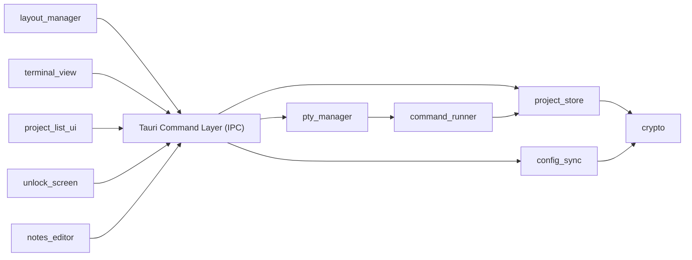

# System Architecture — Terminal Navigator

> Version 1.0 · 2026-07-17 · Status: approved
> Package: architecture.md (this file) · adr/ (decision records)
> Downstream: db-schema-designer → §5 (optional/light-touch — see note) · backend-implementer → all · design-implementer → §5.6 + §7 (frontend structure)
> Source PRD: docs/prd-terminal-navigator.md (v1.2)

## 1. System overview

Terminal Navigator is a single-user Rust + Tauri desktop application that replaces the author's Tilix + zsh workflow. It stores a list of local project entries (path, auto-run setup commands, notes) and lets the user open a terminal already `cd`-ed into a project's path with one click. Terminals live in a Tilix-style tab + split-pane grid: each project opens in a new tab, and any tab can be split into multiple independently-running terminal panes. All data (paths, commands, notes) is encrypted at rest behind a master password, since it may contain credentials. There is no server, no network calls, and no multi-user concern — everything runs on one machine for one person.

## 2. Non-functional requirements & constraints

NFR-1: Performance — opening a terminal + running its auto-command must feel instant (no perceptible app-side lag before the shell takes over).
NFR-2: Availability — N/A, local single-user desktop app.
NFR-3: Security / data sensitivity — paths, commands, and notes may contain credentials/API keys; must be encrypted at rest; no network transmission.
NFR-4: Scalability — personal scale only (tens to low hundreds of projects); not designed for large multi-team catalogs.
NFR-5: Portability — config must be git-trackable and/or export/importable across devices.
NFR-6: Learnability — author is new to Rust and Tauri; favor mature, well-documented, pure-Rust-where-possible libraries over cutting-edge/exotic choices.
NFR-7: Resource efficiency — app must be lightweight, fast to start, and memory-friendly, especially with several concurrent PTY sessions/panes open for long periods.
CON-1: Solo developer, casual side-project pace, no fixed schedule.
CON-2: Author's first project in Rust and Tauri.
CON-3: No hard deadline.
CON-4: Tooling/libraries must be free / open-source — no paid dependencies or services.
CON-5: Primary target OS is Linux; Windows/macOS support is optional, not required for MVP.

## 3. System context

- **Local Filesystem** — project directories the app launches terminals into, plus the single encrypted data file holding all app data.
- **OS Shell** — one PTY-spawned shell process per open pane; the app never talks to a shell except through a PTY.
- **Git** — not integrated into the app; the user manually commits/pulls the encrypted data file as part of their own dotfiles-style workflow (NFR-5).

## 4. Architecture style

**Single Tauri desktop app, modular monolith** — Rust backend (Tauri core) split into cohesive modules, paired with a Svelte frontend (webview). No distribution of any kind: this is single-user, single-process, single-machine software, so a services split would add pure overhead with no NFR to justify it. See ADR-0001.

## 5. Module decomposition

### 5.1 project_store (Rust)
- **Responsibility:** CRUD for project entries; holds the in-memory + persisted list of projects.
- **Owns entities:** `Project` (id, name, path, setup_commands, notes, created_at/updated_at — field-level detail is backend-implementer's concern, not architecture's).
- **Depends on:** `crypto` (to encrypt/decrypt its persisted data).
- **Notes:** Sole owner of `Project`. No other module reads/writes project data directly — `pty_manager` and `command_runner` go through this module to read a project's path/commands.

### 5.2 crypto (Rust)
- **Responsibility:** Derive the encryption key from the master password; encrypt/decrypt the app's data blob.
- **Owns entities:** none (a service module, not a data owner).
- **Depends on:** none.
- **Notes:** The only module that ever holds the derived key in memory. See ADR-0005.

### 5.3 pty_manager (Rust)
- **Responsibility:** Spawn and track one PTY session per open pane; stream I/O between each PTY and its frontend pane over Tauri events.
- **Owns entities:** `PtySession` (id, working_dir, process handle) — runtime-only, never persisted.
- **Depends on:** `command_runner` (to feed auto-run commands into a freshly spawned session).
- **Notes:** Closing a pane tears down exactly its own `PtySession`; sessions are fully independent of each other. See ADR-0003, ADR-0007.

### 5.4 command_runner (Rust)
- **Responsibility:** Write a project's configured setup command(s) into a freshly spawned PTY session before handing control to the user.
- **Owns entities:** none.
- **Depends on:** `project_store` (to read a project's configured commands).

### 5.5 config_sync (Rust)
- **Responsibility:** Export the current encrypted data file to a chosen location; import (replace) it from a chosen file.
- **Owns entities:** none.
- **Depends on:** `crypto` (import must decrypt with the current master password to validate before replacing local data).
- **Notes:** MVP import is replace-only, not merge. See ADR-0008.

### 5.6 Frontend modules (Svelte, webview)
- **project_list_ui** — renders the project list; add/edit/delete forms; the native folder-browse dialog trigger (calls Tauri's dialog API).
- **layout_manager** — owns tab/pane grid state (which panes exist, their arrangement, active tab); pure UI state, no PTY knowledge beyond session IDs.
- **terminal_view** — one `xterm.js` instance per pane; renders PTY output, forwards keystrokes; subscribes to that pane's session ID event stream.
- **unlock_screen** — master password entry on launch; calls `crypto` (via IPC) to unlock.
- **notes_editor** — per-project notes view/edit, shown alongside a project's detail.

**Dependency rule:** arrows point one way; a change that introduces a cycle is an architecture change and requires a new ADR.

> **Note on db-schema-designer applicability:** storage is a single serialized+encrypted blob (ADR-0004), not a relational database — there is no ERD to draw. db-schema-designer can still be used in a light-touch way to nail down the `Project` struct's fields/types/validation rules if useful, but it is not required before backend-implementer starts; a plain Rust struct definition is sufficient for this project's scale (NFR-4).

## 6. Cross-cutting decisions

| Concern | Decision | Driven by | ADR |
|---|---|---|---|
| AuthN | Master password unlocks local data on app launch; not multi-user auth | NFR-3 | 0005 |
| AuthZ | N/A — single user, no roles | — | — |
| Key derivation | Argon2id (password → encryption key) | NFR-3, NFR-6 | 0005 |
| Encryption at rest | AES-256-GCM over the whole data blob | NFR-3 | 0004, 0005 |
| Background jobs | None needed | — | — |
| Caching | None needed (personal-scale in-memory data) | NFR-4 | — |
| File storage | Single encrypted file (JSON/bincode + AES-GCM), doubles as the git-trackable/export artifact | NFR-5, NFR-6 | 0004 |
| Terminal rendering | `xterm.js` + WebGL renderer addon | NFR-7 | 0006 |
| Notifications | N/A | — | — |
| Logging & errors | `tracing` crate → local log file, for the author's own debugging while learning Rust | NFR-6, CON-2 | — |
| Backups | Covered by FR-07 export; no separate backup system | NFR-4 | — |
| Packaging | Tauri's built-in bundler → AppImage + `.deb` | CON-4, CON-5 | — |

## 7. Tech stack

| Layer | Choice | Rationale |
|---|---|---|
| App shell | Tauri | User's explicit choice; produces a far lighter binary than Electron (NFR-7) with no bundled Chromium |
| Backend | Rust | Fixed by user's choice; also Tauri's native language |
| Frontend framework | Svelte | Compiles away the framework at build time — no virtual DOM, smaller bundle, lower runtime memory than React — directly serves NFR-7 with FR-08's many concurrent panes. See ADR-0002 |
| Terminal renderer | `xterm.js` + `@xterm/addon-webgl` | Industry standard (VS Code, Hyper); WebGL addon keeps multi-pane rendering cheap on CPU/memory (NFR-7). See ADR-0006 |
| PTY | `portable-pty` (WezTerm project) | Mature, cross-platform (Linux/macOS/Windows via ConPTY), proven in production. See ADR-0003 |
| Storage | Single encrypted file (`bincode`/`serde_json` + `aes-gcm` crate) | Simplest for a Rust beginner (NFR-6); pure-Rust, no C-library linking; file itself satisfies NFR-5. See ADR-0004 |
| Crypto | `argon2` (key derivation) + `aes-gcm` (RustCrypto) | Pure-Rust, no OpenSSL/C linking pain (NFR-6); standard modern recipe. See ADR-0005 |
| Logging | `tracing` | Standard Rust ecosystem choice, low overhead |
| Packaging | Tauri bundler (AppImage, `.deb`) | Built in, free, no extra tooling (CON-4) |

## 8. Deployment shape

One box: the author's own Linux machine, running the AppImage or `.deb` package Tauri's bundler produces. No server, no cloud infra, no CI/CD requirement for the app to function.

**At 10× load** (many more projects, or much larger notes per project): the single-encrypted-file approach still holds — NFR-4 caps realistic scale at "hundreds of projects," well within what an in-memory struct + serialize-on-write can handle instantly. If that ceiling is ever genuinely exceeded, the only module that needs to change is `project_store` (swap its persistence backend to SQLite) — no other module is coupled to the storage format, by design (§5.1).

## 9. Risks & open questions

1. **Compounding first-Rust-project risk.** PTY handling, multi-pane multiplexing (FR-08), and encryption are each individually nontrivial for a first Rust/Tauri project; doing all three at once risks stalling momentum. *Mitigation:* no architectural blocker — implement incrementally (single-tab/single-pane first, then tabs, then split-panes) since CON-1/CON-3 impose no deadline. Revisit if the author reports being stuck for multiple sessions on any one module.
2. **WebGL renderer availability.** `@xterm/addon-webgl` requires a working WebGL context in the webview; Tauri's Linux webview (WebKitGTK) generally supports this, but should be verified early. *Revisit if:* WebGL context creation fails on the target system — fall back to xterm.js's default canvas renderer (still acceptable, just less optimal for NFR-7).
3. **Import replace-only (ADR-0008) may feel limiting later** if the author wants to merge project lists from two devices rather than fully replace. *Revisit if:* this friction is actually felt in practice — add merge logic as a next-iteration feature at that point, not before.
4. **Windows/macOS support (CON-5, optional)** is not blocked by any decision here — `portable-pty` and Tauri both support all three OSes — but has not been tested. *Revisit when/if the author actually wants to run on those platforms.*

## 10. Instructions for AI agents

You are working within this architecture. Follow these rules:

1. **Source-of-truth order:** `adr/` (rationale) → this file (structure) → downstream docs for their own domains. On conflict, report it; don't silently pick.
2. **Respect module boundaries.** Code for one module never reaches into another module's entities directly (e.g., frontend `terminal_view` never reads `project_store` data except through the IPC layer; `pty_manager` never persists data itself — that's `project_store`'s job via `crypto`). New cross-module dependencies require updating §5 + an ADR.
3. **Entity ownership is exclusive.** Only `project_store` reads/writes `Project`; only `pty_manager` creates/destroys `PtySession`.
4. **Cross-cutting concerns use §6's decisions** — never introduce a second storage format, crypto scheme, or terminal-rendering approach without a new ADR.
5. **Uncovered cases:** follow the nearest decision's pattern, flag as "unspecified — architecture review needed" in your summary.
6. **Do not modify this package** unless explicitly asked; propose changes as draft ADRs instead.
7. **db-schema-designer is optional here** (see §5 note) — do not force a relational schema onto a single-file store; only invoke it if the `Project` data model grows complex enough to warrant it.
8. **api-designer does not apply** — there is no REST/GraphQL API; the module contract in §5 plus Tauri command signatures (defined during backend-implementer's work) is the equivalent contract.

## 11. Changelog

| Version | Date | Change |
|---|---|---|
| 1.0 | 2026-07-17 | Initial architecture, approved after checkpoint covering: architecture style, frontend framework, PTY library, storage engine, encryption, terminal rendering, tab/pane-PTY session model, import behavior. |
