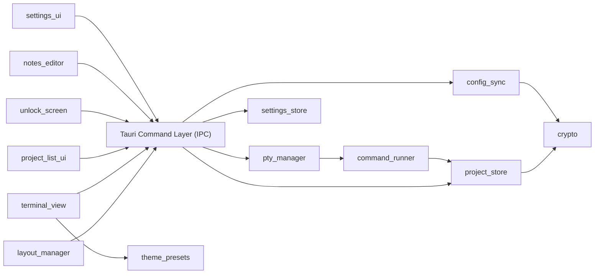

# System Architecture — Terminal Navigator

> Version 1.3 · 2026-07-20 · Status: approved
> Package: architecture.md (this file) · adr/ (decision records)
> Downstream: db-schema-designer → §5 (optional/light-touch — see note) · backend-implementer → all · design-implementer → §5.7 + §7 (frontend structure)
> Source PRD: docs/prd-terminal-navigator.md (v1.5)

## 1. System overview

Terminal Navigator is a single-user Rust + Tauri desktop application that replaces the author's Tilix + zsh workflow. It stores a list of local project entries (path, auto-run setup commands, notes) and lets the user open a terminal already `cd`-ed into a project's path with one click. Terminals live in a Tilix-style tab + split-pane grid: each project opens in a new tab, and any tab can be split into multiple independently-running terminal panes. All data (paths, commands, notes) is encrypted at rest behind a master password, since it may contain credentials. There is no server, no network calls, and no multi-user concern — everything runs on one machine for one person.

## 2. Non-functional requirements & constraints

NFR-1: Performance — opening a terminal + running its auto-command must feel instant (no perceptible app-side lag before the shell takes over).
NFR-2: Availability — N/A, local single-user desktop app.
NFR-3: Security / data sensitivity — paths, commands, and notes may contain credentials/API keys; must be encrypted at rest; no network transmission.
NFR-4: Scalability — personal scale only (tens to low hundreds of projects); not designed for large multi-team catalogs.
NFR-5: Portability — config must be git-trackable and/or export/importable across devices.
NFR-6: Learnability — author is new to Rust and Tauri; favor mature, well-documented, pure-Rust-where-possible libraries over cutting-edge/exotic choices.
NFR-7: Resource efficiency — app must be lightweight, fast to start, and memory-friendly, especially with several concurrent PTY sessions/panes open for long periods.
NFR-8: Security / data sensitivity — non-sensitive preferences (theme, keybindings, sidebar position — FR-13) must NOT require the app to be unlocked to read or apply; stored separately from the encrypted data blob (NFR-3/ADR-0004) so app chrome renders correctly even at the unlock screen.
CON-1: Solo developer, casual side-project pace, no fixed schedule.
CON-2: Author's first project in Rust and Tauri.
CON-3: No hard deadline.
CON-4: Tooling/libraries must be free / open-source — no paid dependencies or services.
CON-5: Primary target OS is Linux; Windows/macOS support is optional, not required for MVP.

## 3. System context

- **Local Filesystem** — project directories the app launches terminals into, the single encrypted data file holding all project data, and (since FR-13) a separate unencrypted `settings.json` holding non-sensitive preferences (ADR-0009).
- **OS Shell** — one PTY-spawned shell process per open pane; the app never talks to a shell except through a PTY.
- **Git** — not integrated into the app; the user manually commits/pulls the encrypted data file as part of their own dotfiles-style workflow (NFR-5).

## 4. Architecture style

**Single Tauri desktop app, modular monolith** — Rust backend (Tauri core) split into cohesive modules, paired with a Svelte frontend (webview). No distribution of any kind: this is single-user, single-process, single-machine software, so a services split would add pure overhead with no NFR to justify it. See ADR-0001.

## 5. Module decomposition

### 5.1 project_store (Rust)
- **Responsibility:** CRUD for project entries; holds the in-memory + persisted list of projects.
- **Owns entities:** `Project` (id, name, path, setup_commands, notes, created_at/updated_at — field-level detail is backend-implementer's concern, not architecture's).
- **Depends on:** `crypto` (to encrypt/decrypt its persisted data).
- **Notes:** Sole owner of `Project`. No other module reads/writes project data directly — `pty_manager` and `command_runner` go through this module to read a project's path/commands.

### 5.2 crypto (Rust)
- **Responsibility:** Derive the encryption key from the master password; encrypt/decrypt the app's data blob.
- **Owns entities:** none (a service module, not a data owner).
- **Depends on:** none.
- **Notes:** The only module that ever holds the derived key in memory. See ADR-0005.

### 5.3 pty_manager (Rust)
- **Responsibility:** Spawn and track one PTY session per open pane; stream I/O between each PTY and its frontend pane over Tauri events, including notifying the frontend when the shell exits on its own (`pty://exit/{session_id}`, no payload — user typed `exit`, shell crashed, etc.), so the pane can close itself the same way a user-initiated "Close pane" would.
- **Owns entities:** `PtySession` (id, working_dir, process handle) — runtime-only, never persisted.
- **Depends on:** `command_runner` (to feed auto-run commands into a freshly spawned session).
- **Notes:** Closing a pane tears down exactly its own `PtySession`; sessions are fully independent of each other. A session whose shell exited on its own is *not* torn down by `pty_manager` itself — it stays registered (inert) until the frontend reacts to the exit event by calling the normal close IPC command, same cleanup path either way. See ADR-0003, ADR-0007.

### 5.4 command_runner (Rust)
- **Responsibility:** Write a project's configured setup command(s) into a freshly spawned PTY session before handing control to the user.
- **Owns entities:** none.
- **Depends on:** `project_store` (to read a project's configured commands).

### 5.5 config_sync (Rust)
- **Responsibility:** Export the current encrypted data file to a chosen location; import (replace) it from a chosen file.
- **Owns entities:** none.
- **Depends on:** `crypto` (import must decrypt with the current master password to validate before replacing local data).
- **Notes:** MVP import is replace-only, not merge. See ADR-0008.

### 5.6 settings_store (Rust) — added FR-13, v1.1
- **Responsibility:** Load/save the app's non-sensitive preferences (theme preset id, keybinding map, sidebar position) to a plaintext `settings.json`, independent of whether `project_store` is unlocked.
- **Owns entities:** `Settings` (theme_preset: String, keybindings: HashMap<String, String>, sidebar_position: enum).
- **Depends on:** none — no `crypto` dependency, by design (NFR-8).
- **Notes:** Not gated by unlock; commands built on this module must remain callable before `unlock`. Validates keybinding conflicts generically (no two actions share one combo) without needing to know what any action does. See ADR-0009.

**Default keybinding registry (FR-13, extended twice post-FR-13: zoom, then tab-cycling).** Resolved during the FR-13 pass: the audit found only 2 real app shortcuts existed before FR-13 (both in `terminal_view`); 4 more were new actions that feature introduced (in `layout_manager`), not previously bindable by any means. The registry must stay extensible for more actions later — 2 more (`terminal.zoomIn`/`terminal.zoomOut`) were added in a follow-up pass, and 2 more after that (`terminal.nextTab`/`terminal.previousTab`), confirming that extensibility twice over — nothing broader ("every widget's Escape/Tab/Arrow" navigation, audited in `Modal.svelte`/`Menu.svelte`/`PaneNodeView.svelte`, is intrinsic widget behavior, not a rebindable app action):

| Action id | Default combo | Owning frontend module |
|---|---|---|
| `clipboard.copy` | Ctrl+Shift+C | `terminal_view` |
| `clipboard.paste` | Ctrl+Shift+V | `terminal_view` |
| `pane.splitBottom` | Alt+Shift+D | `layout_manager` |
| `pane.splitRight` | Alt+Shift+R | `layout_manager` |
| `pane.moveFocusLeft` | Alt+ArrowLeft | `layout_manager` |
| `pane.moveFocusRight` | Alt+ArrowRight | `layout_manager` |
| `pane.moveFocusUp` | Alt+ArrowUp | `layout_manager` |
| `pane.moveFocusDown` | Alt+ArrowDown | `layout_manager` |
| `terminal.zoomIn` | Ctrl+= | `terminal_view` |
| `terminal.zoomOut` | Ctrl+- | `terminal_view` |
| `terminal.nextTab` | Ctrl+Tab | `layout_manager` |
| `terminal.previousTab` | Ctrl+Shift+Tab | `layout_manager` |

`pane.splitBottom`/`pane.splitRight` reuse the existing `split_pane` Tauri command and drag-to-split semantics (FR-08) — same operation, triggered from a keybinding against the currently-focused pane instead of a drag target. `pane.moveFocus*` is purely a frontend focus change (no IPC call) via `layout_manager`'s pane-tree adjacency lookup. `terminal.zoomIn`/`zoomOut` are a pure `terminal_view` concern (xterm.js font-size adjustment + refit) — no IPC call either; **not yet implemented as of this table update**, this is a registry-only extension (settings_store defaults + frontend registry), the actual zoom mechanism is a separate, still-pending design-implementer pass. A companion Ctrl+Scroll (mouse wheel) gesture for the same zoom action is also planned but is a fixed gesture, not itself a rebindable entry in this table — the same relationship `pane.splitBottom`'s keybinding has to drag-to-split's fixed gesture for the same underlying operation. `terminal.nextTab`/`previousTab` switch which *tab* is active (`terminalStore.activeTabId`) — a different concept from `pane.moveFocus*`, which moves focus between panes within one already-active tab; also not yet implemented as of this table update, `layout_manager`'s job in the next pass (a `terminalStore` cycle-tab method + `TerminalArea.svelte` keydown wiring, same capture-phase pattern as the pane shortcuts).

**Gap found while adding these last two (KeybindingRow.svelte, unrelated to this table) — since fixed:** the Settings panel's rebind-capture logic checked `event.key === "Tab"` to let Tab move focus normally within the modal while another row records — but `event.key` is `"Tab"` regardless of held modifiers, so `Ctrl+Tab`/`Ctrl+Shift+Tab` could never actually be *captured* through that UI; every attempt cancelled recording instead. Resolved in the design-implementer pass that implemented tab-cycling: the check now only cancels for *bare* Tab (or Shift+Tab — Shift alone isn't a "required modifier," see `hasRequiredModifier`), so a modified Tab falls through to normal capture like any other combo.

### 5.7 Frontend modules (Svelte, webview)
- **project_list_ui** — renders the project list; add/edit/delete forms; the native folder-browse dialog trigger (calls Tauri's dialog API).
- **layout_manager** — owns tab/pane grid state (which panes exist, their arrangement, active tab); pure UI state, no PTY knowledge beyond session IDs. *Extended, FR-13:* also resolves "adjacent pane in direction X" (for keyboard pane-focus movement) and exposes a "split focused pane in direction X" operation callable from a keybinding as well as from drag-to-split (FR-08) — same underlying split operation, two trigger sources.
- **terminal_view** — one `xterm.js` instance per *session*, rendering PTY output and forwarding keystrokes; subscribes to that session's event stream. *Extended, FR-13:* applies the selected theme preset's full xterm `Theme` object (see `theme_presets`, below) instead of a partial set of CSS-var-derived colors; looks up clipboard copy/paste combos from `keybindings` state instead of the hardcoded Ctrl+Shift+C/V. *Extended again (debugger session, perpendicular-split remount bug):* the `Terminal` instance, its scrollback, and its PTY subscriptions are no longer owned by `<TerminalPane>`'s own Svelte component lifecycle — they live in a small session-keyed registry (`$lib/terminal-registry`) that survives a forced component remount, because certain `layout_manager` tree restructurings (a cross-direction split, a drag-to-split graft) force Svelte to destroy and recreate the component even though the session itself never closed, and no `{#each}` keying strategy can prevent that (the leaf's key leaves its old block's key space entirely). Disposal is centralized to the two call sites that actually confirm a session closed (`TerminalArea.svelte`'s `handleClosePane`, `Sidebar.svelte`'s `closeSession`), never `<TerminalPane>`'s own `onDestroy`.
- **unlock_screen** — master password entry on launch; calls `crypto` (via IPC) to unlock.
- **notes_editor** — per-project notes view/edit, shown alongside a project's detail.
- **settings_ui** *(new, FR-13)* — renders the Settings modal (theme picker, master-password-change form, keybinding rebind list with conflict feedback, sidebar-position toggle); reads/writes through `get_settings`/`save_settings`/`change_master_password` IPC commands.
- **theme_presets** *(new, FR-13)* — static, frontend-only data module: the fixed list of named presets, each a complete xterm.js `Theme` (background, foreground, cursor, cursorAccent, full ANSI 16-color table). Owns no Rust-visible state — the backend only ever sees the selected preset's id (ADR-0009). Concrete preset values are ui-ux-designer's to define (PRD Q6).

**Dependency rule:** arrows point one way; a change that introduces a cycle is an architecture change and requires a new ADR.

> **Note on db-schema-designer applicability:** storage is a single serialized+encrypted blob (ADR-0004) plus, since FR-13, a second plain `settings.json` (ADR-0009) — neither is a relational database, so there is no ERD to draw. db-schema-designer can still be used in a light-touch way to nail down the `Project` or `Settings` struct's fields/types/validation rules if useful, but it is not required before backend-implementer starts; plain Rust struct definitions are sufficient for this project's scale (NFR-4).

## 6. Cross-cutting decisions

| Concern | Decision | Driven by | ADR |
|---|---|---|---|
| AuthN | Master password unlocks local data on app launch; not multi-user auth | NFR-3 | 0005 |
| AuthZ | N/A — single user, no roles | — | — |
| Key derivation | Argon2id (password → encryption key) | NFR-3, NFR-6 | 0005 |
| Encryption at rest | AES-256-GCM over the whole data blob | NFR-3 | 0004, 0005 |
| Background jobs | None needed | — | — |
| Caching | None needed (personal-scale in-memory data) | NFR-4 | — |
| File storage | Single encrypted file (JSON/bincode + AES-GCM), doubles as the git-trackable/export artifact | NFR-5, NFR-6 | 0004 |
| Terminal rendering | `xterm.js` + WebGL renderer addon | NFR-7 | 0006 |
| Notifications | N/A | — | — |
| Logging & errors | `tracing` crate → local log file, for the author's own debugging while learning Rust | NFR-6, CON-2 | — |
| Backups | Covered by FR-07 export; no separate backup system | NFR-4 | — |
| Packaging | Tauri's built-in bundler → AppImage + `.deb` | CON-4, CON-5 | — |
| Non-sensitive settings storage | Plaintext `settings.json` in the same `app_data_dir()`, owned by `settings_store`, no unlock gate | NFR-8, FR-13 | 0009 |
| Master password rotation | Verify current password → derive new key/salt → atomic re-encrypt (temp file + rename) via `ProjectStore::change_password` | NFR-3, FR-13 | 0010 |

## 7. Tech stack

| Layer | Choice | Rationale |
|---|---|---|
| App shell | Tauri | User's explicit choice; produces a far lighter binary than Electron (NFR-7) with no bundled Chromium |
| Backend | Rust | Fixed by user's choice; also Tauri's native language |
| Frontend framework | Svelte | Compiles away the framework at build time — no virtual DOM, smaller bundle, lower runtime memory than React — directly serves NFR-7 with FR-08's many concurrent panes. See ADR-0002 |
| Terminal renderer | `xterm.js` + `@xterm/addon-webgl` | Industry standard (VS Code, Hyper); WebGL addon keeps multi-pane rendering cheap on CPU/memory (NFR-7). See ADR-0006 |
| PTY | `portable-pty` (WezTerm project) | Mature, cross-platform (Linux/macOS/Windows via ConPTY), proven in production. See ADR-0003 |
| Storage | Single encrypted file (`bincode`/`serde_json` + `aes-gcm` crate) | Simplest for a Rust beginner (NFR-6); pure-Rust, no C-library linking; file itself satisfies NFR-5. See ADR-0004 |
| Crypto | `argon2` (key derivation) + `aes-gcm` (RustCrypto) | Pure-Rust, no OpenSSL/C linking pain (NFR-6); standard modern recipe. See ADR-0005 |
| Logging | `tracing` | Standard Rust ecosystem choice, low overhead |
| Packaging | Tauri bundler (AppImage, `.deb`) | Built in, free, no extra tooling (CON-4) |

## 8. Deployment shape

One box: the author's own Linux machine, running the AppImage or `.deb` package Tauri's bundler produces. No server, no cloud infra, no CI/CD requirement for the app to function.

**At 10× load** (many more projects, or much larger notes per project): the single-encrypted-file approach still holds — NFR-4 caps realistic scale at "hundreds of projects," well within what an in-memory struct + serialize-on-write can handle instantly. If that ceiling is ever genuinely exceeded, the only module that needs to change is `project_store` (swap its persistence backend to SQLite) — no other module is coupled to the storage format, by design (§5.1).

## 9. Risks & open questions

1. **Compounding first-Rust-project risk.** PTY handling, multi-pane multiplexing (FR-08), and encryption are each individually nontrivial for a first Rust/Tauri project; doing all three at once risks stalling momentum. *Mitigation:* no architectural blocker — implement incrementally (single-tab/single-pane first, then tabs, then split-panes) since CON-1/CON-3 impose no deadline. Revisit if the author reports being stuck for multiple sessions on any one module.
2. **WebGL renderer availability.** `@xterm/addon-webgl` requires a working WebGL context in the webview; Tauri's Linux webview (WebKitGTK) generally supports this, but should be verified early. *Revisit if:* WebGL context creation fails on the target system — fall back to xterm.js's default canvas renderer (still acceptable, just less optimal for NFR-7).
3. **Import replace-only (ADR-0008) may feel limiting later** if the author wants to merge project lists from two devices rather than fully replace. *Revisit if:* this friction is actually felt in practice — add merge logic as a next-iteration feature at that point, not before.
4. **Windows/macOS support (CON-5, optional)** is not blocked by any decision here — `portable-pty` and Tauri both support all three OSes — but has not been tested. *Revisit when/if the author actually wants to run on those platforms.*
5. **User-rebound keybindings colliding with OS/webview-native commands (FR-13).** The clipboard shortcut bug fixed 2026-07-20 (`TerminalPane.svelte`'s Ctrl+Shift+V silently double-firing because the browser/webview's own native paste action wasn't suppressed) is one instance of a general class: once users can rebind shortcuts to arbitrary combinations, any combo the OS/WebKitGTK treats as a native command is a similar risk, not just the one already fixed. *Mitigation:* design-implementer/backend-implementer should call `event.preventDefault()` for every custom-handled combo (not just the two already covered), and ui-ux-designer should consider warning the user in the rebind UI if a chosen combo is a common OS-reserved one. No architectural blocker — this is an implementation-discipline risk, not a structural one.

## 10. Instructions for AI agents

You are working within this architecture. Follow these rules:

1. **Source-of-truth order:** `adr/` (rationale) → this file (structure) → downstream docs for their own domains. On conflict, report it; don't silently pick.
2. **Respect module boundaries.** Code for one module never reaches into another module's entities directly (e.g., frontend `terminal_view` never reads `project_store` data except through the IPC layer; `pty_manager` never persists data itself — that's `project_store`'s job via `crypto`). New cross-module dependencies require updating §5 + an ADR.
3. **Entity ownership is exclusive.** Only `project_store` reads/writes `Project`; only `pty_manager` creates/destroys `PtySession`; only `settings_store` reads/writes `Settings` (theme/keybindings/sidebar position) — it has no `crypto` dependency and must stay that way (NFR-8).
4. **Cross-cutting concerns use §6's decisions** — never introduce a second storage format, crypto scheme, or terminal-rendering approach without a new ADR.
5. **Uncovered cases:** follow the nearest decision's pattern, flag as "unspecified — architecture review needed" in your summary.
6. **Do not modify this package** unless explicitly asked; propose changes as draft ADRs instead.
7. **db-schema-designer is optional here** (see §5 note) — do not force a relational schema onto a single-file store; only invoke it if the `Project` data model grows complex enough to warrant it.
8. **api-designer does not apply** — there is no REST/GraphQL API; the module contract in §5 plus Tauri command signatures (defined during backend-implementer's work) is the equivalent contract.

## 11. Changelog

| Version | Date | Change |
|---|---|---|
| 1.0 | 2026-07-17 | Initial architecture, approved after checkpoint covering: architecture style, frontend framework, PTY library, storage engine, encryption, terminal rendering, tab/pane-PTY session model, import behavior. |
| 1.1 | 2026-07-20 | FR-13 (Settings Panel): added NFR-8; added `settings_store` (Rust, §5.6) and frontend modules `settings_ui`/`theme_presets` (§5.7); extended `layout_manager` (pane-focus movement + keyboard-triggered split) and `terminal_view` (preset-driven theme, settings-driven clipboard combos); added ADR-0009 (unencrypted settings store, location/module/entity shape) and ADR-0010 (master password rotation via atomic re-encrypt, which also makes all `project_store` saves crash-safe). Added risk #5 (keybinding/native-command collision class). Checkpoint resolved: settings file location (same `app_data_dir()`, not a separate `app_config_dir()`) and keybinding scope (2 existing clipboard actions + 4 new pane actions — split-bottom/split-right/move-focus×4 — not a blanket "every shortcut"). |
| 1.2 | 2026-07-20 | Keybinding registry extended to 10 actions (§5.6): added `terminal.zoomIn` (Ctrl+=) / `terminal.zoomOut` (Ctrl+-), confirming the registry's designed extensibility. Registry-only change (settings_store Rust defaults + frontend registry/type widening) — the actual zoom mechanism (font-size adjustment, refit, Ctrl+Scroll wheel gesture) is a separate, not-yet-implemented design-implementer pass. |
| 1.3 | 2026-07-20 | Keybinding registry extended to 12 actions (§5.6): added `terminal.nextTab` (Ctrl+Tab) / `terminal.previousTab` (Ctrl+Shift+Tab) for tab-cycling (distinct from `pane.moveFocus*`, which is within-tab pane focus). Registry-only change again — tab-cycling logic itself is a pending design-implementer pass. Found and documented (not fixed) a real gap while adding these: `KeybindingRow.svelte`'s rebind-capture logic can never actually capture a Tab-containing combo (its Tab-cancels-recording check doesn't look at modifiers), so `terminal.nextTab`/`previousTab` work correctly as defaults but can't currently be rebound via the Settings UI — left as a documented failing test, fix deferred to whoever implements the tab-cycling behavior next. |
| 1.4 | 2026-07-21 | `terminal_view` (§5.7) amended: fixed the perpendicular-split remount bug (test-plan.md's formerly-accepted gap) by decoupling the xterm.js `Terminal`/scrollback/PTY subscriptions from `<TerminalPane>`'s own component lifecycle into a session-keyed registry (`$lib/terminal-registry`) — the root cause was structural (Svelte's keyed `{#each}` reconciliation cannot preserve a component instance across a leaf being wrapped in a brand-new ancestor node, for any choice of keys), so the fix makes the remount harmless instead of trying to prevent it. Disposal is now centralized to `TerminalArea.svelte`'s `handleClosePane`/`Sidebar.svelte`'s `closeSession`, not the component's own `onDestroy`. |
